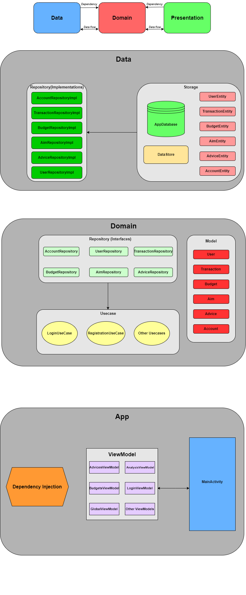
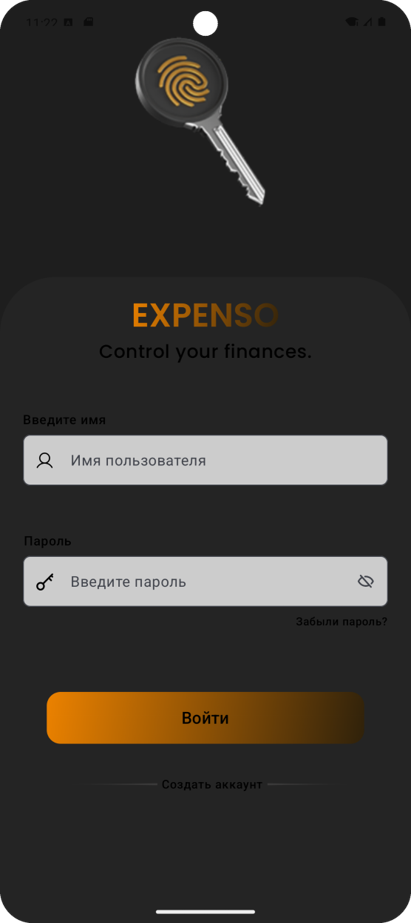
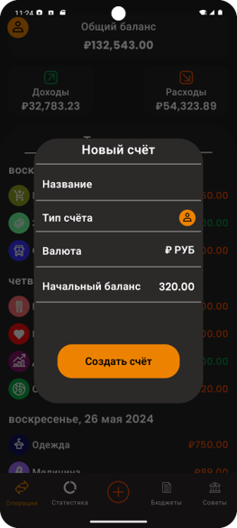
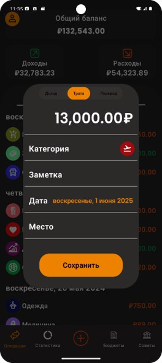
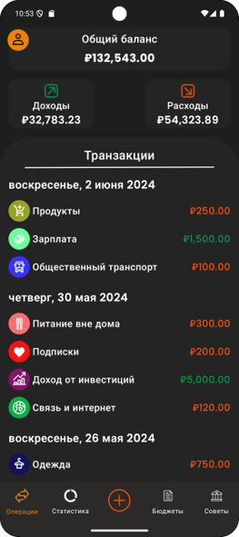
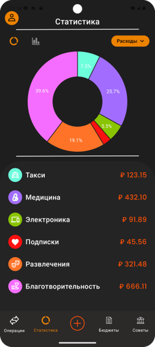
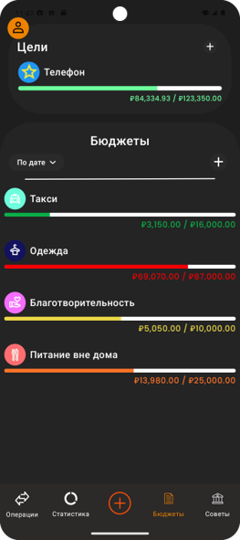
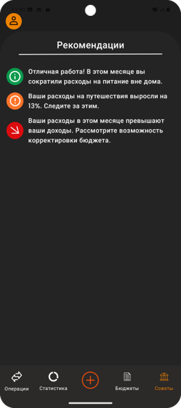

# 💰 Финансовый трекер

**Финансовый трекер** — это легковесное локальное мобильное приложение для Android, разработанное на **Kotlin** с использованием **Jetpack Compose** и современных инструментов **Android SDK**. Приложение помогает пользователю вести учёт доходов и расходов, категоризировать операции, анализировать свои финансовые привычки и достигать бюджетных целей — **без подключения к сети**.

---

## 🎯 Цель проекта

Целью работы является **практическое освоение технологий Android-разработки** путём создания мобильного приложения, ориентированного на ключевые потребности пользователя:

- учёт финансовых операций по категориям;
- подробная статистика и визуализация;
- работа **в оффлайн-режиме**;
- **надежное локальное хранение** данных;
- интуитивный и минималистичный интерфейс.

---

## 🛠️ Технологии и инструменты

| Технология | Назначение |
|-----------|------------|
| **Kotlin** | Язык программирования |
| **Jetpack Compose** | Современный декларативный UI |
| **Room** | Работа с локальной SQLite-базой |
| **Hilt (Dagger)** | Внедрение зависимостей |
| **Jetpack Navigation** | Навигация между экранами |
| **MPAndroidChart** | Визуализация статистики |

---

## 🧱 Архитектура приложения

При разработке приложения использована **многослойная архитектура**, основанная на принципах **Clean Architecture**. Такой подход делает проект:

- гибким и масштабируемым;
- удобным для поддержки и тестирования.

Архитектура разделена на три независимых слоя:

1. **Data** – отвечает за работу с базой данных и локальными хранилищами; 
2. **Domain** – содержит бизнес-логику и интерфейсы;
3. **Presentation** – реализует пользовательский интерфейс и взаимодействие с ним.  

Это обеспечивает **слабую связность компонентов** и высокую модульность.

### 📌 Схема архитектурной модели

---

## 📱 Скриншоты

| Экран загрузки | Экран авторизации | Экран регистрации |
|---------------|----------------------|------------|
|  |  |  |

| Создание счёта | Добавление операции | Экран транзакций |
|---------------|----------------------|------------|
|  |  |  |

| Экран статистики | Экран бюджетов | Экран рекомендаций |
|---------------|----------------------|------------|
|  |  |  |

---

## 🔍 Основные возможности

- 📌 Учет **доходов и расходов** по категориям  
- 📊 Подробная **статистика**: по дням, неделям и месяцам  
- 🎯 Создание **бюджетных целей** и их отслеживание  
- 📈 Анализ тенденций и **рекомендации по оптимизации** бюджета  
- 🔐 Полностью **локальное хранение данных**  
- 🌙 Поддержка **темной темы**  
- 💡 Простой и удобный **интерфейс**
